# Каталог блоков

12 слайдов-паттернов, извлечённых из готовых презентаций
(`html/superqr-meta-ads-audit/`, `html/case-studies-meta-ads/`). Каждый —
самостоятельный `<section class="slide ...">…</section>`, который можно
вставить в новую презентацию как есть и подправить текст/картинки/числа.
Классы берутся из `shared/css/deck.css` — сам блок ничего не описывает заново.

Собирать новую презентацию — значит **не писать разметку с нуля**, а
выбрать подходящие блоки ниже, скопировать в `
…
`
(см. `shared/templates/slide-deck.html`) и отредактировать текст. Внутри
каждого файла — комментарий сверху: когда использовать блок и что именно
менять.

| Блок | Превью | Когда использовать |
|---|---|---|
| [`cover-split.html`](cover-split.html) | 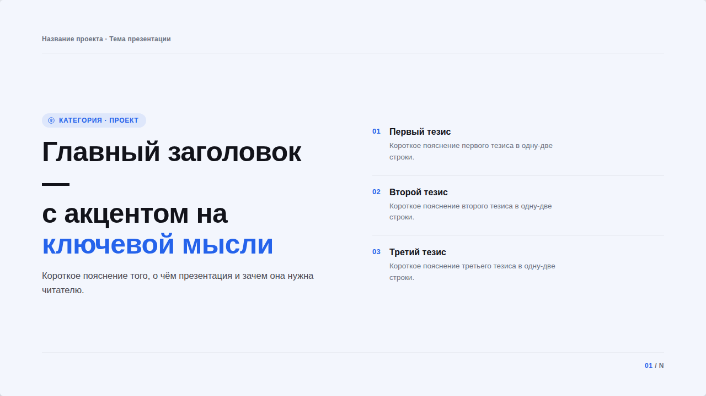 | Титульный слайд: заголовок слева, 2–3 главных тезиса справа |
| [`grid-summary.html`](grid-summary.html) | 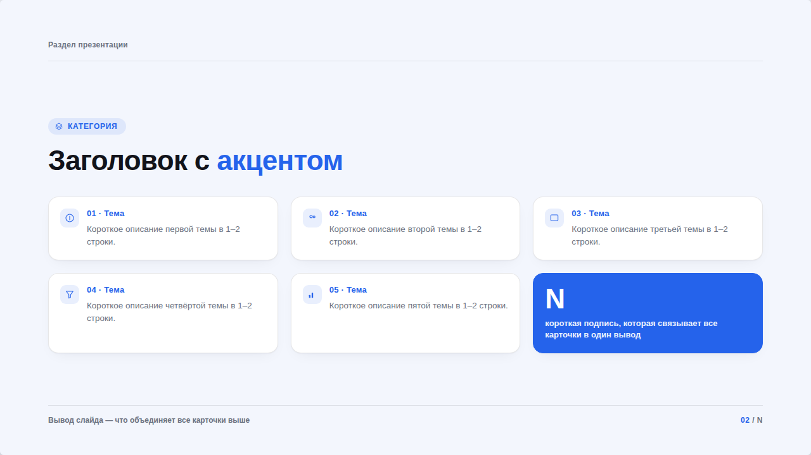 | Обзор разделов/находок — сетка карточек + акцентная карточка со сводной цифрой |
| [`evidence-single.html`](evidence-single.html) | 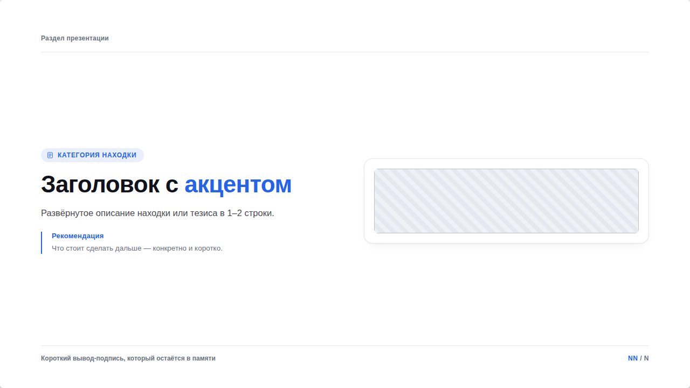 | Один скриншот-доказательство + вывод + рекомендация — самый частый блок |
| [`evidence-dual.html`](evidence-dual.html) | 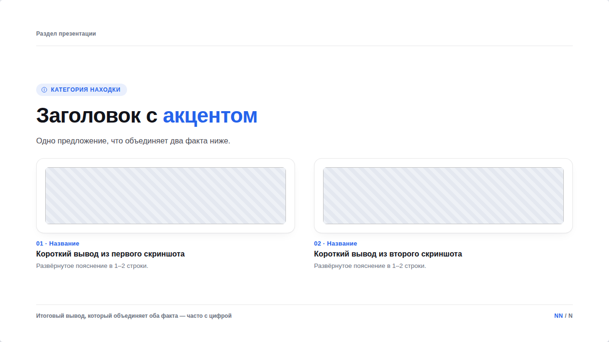 | Два скриншота рядом, у каждого своя короткая подпись |
| [`evidence-comparison.html`](evidence-comparison.html) | 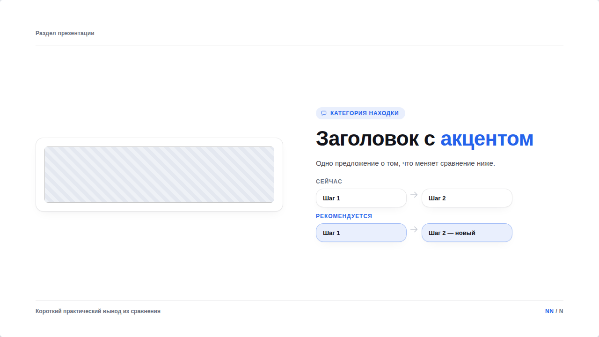 | Скриншот + текст + мини-диаграмма «сейчас / рекомендуется» |
| [`stat-split.html`](stat-split.html) | 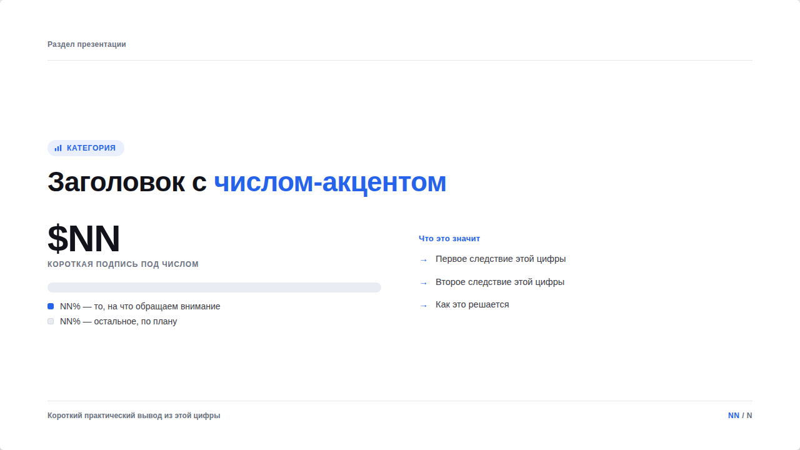 | Одна цифра как доля от целого (полоска), а не два числа текстом |
| [`flow-diagram.html`](flow-diagram.html) | 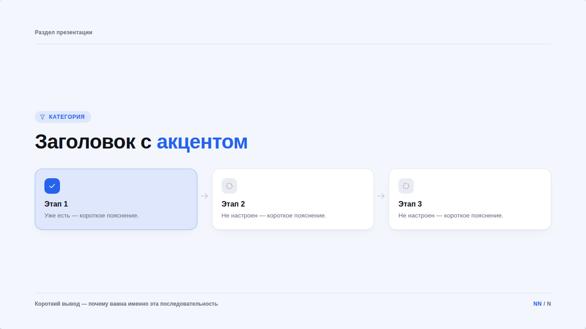 | Воронка/процесс/этапы — связанные узлы со стрелками и статусом (есть/нет) |
| [`concept-checklist.html`](concept-checklist.html) | 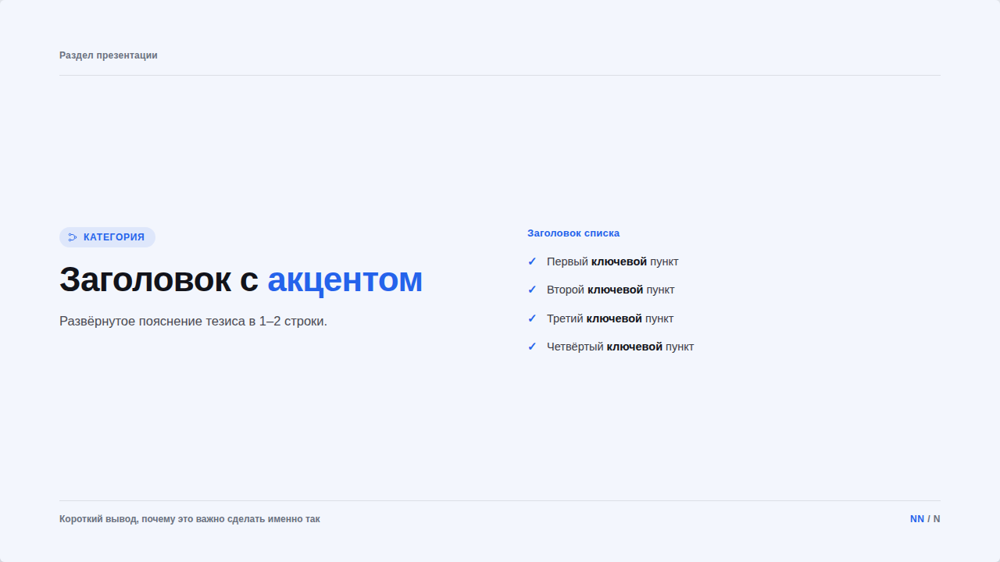 | Тезис без скриншота + чек-лист из 3–5 пунктов |
| [`image-gallery.html`](image-gallery.html) | 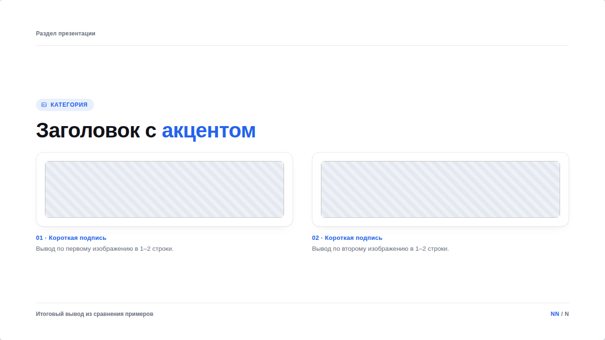 | Несколько изображений в ряд для сравнения (креативы, макеты) |
| [`stepper-roadmap.html`](stepper-roadmap.html) | 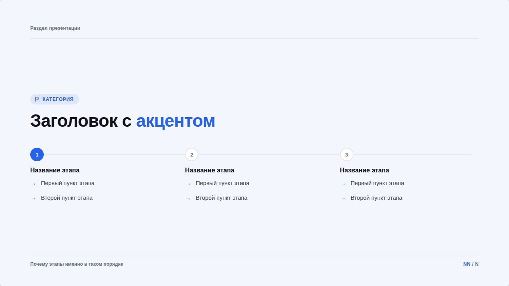 | План внедрения на N этапов на одной шкале |
| [`metrics-table.html`](metrics-table.html) | 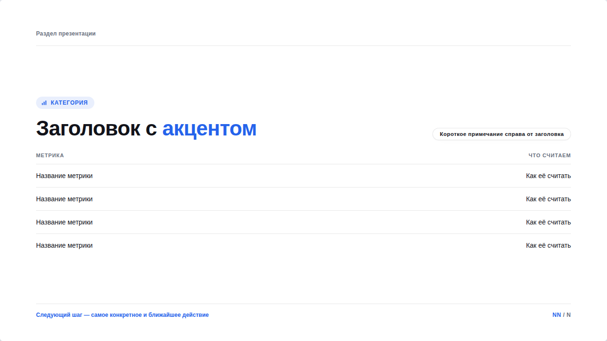 | Закрывающий слайд — таблица метрик + пилюля-примечание |
| [`case-metrics.html`](case-metrics.html) | 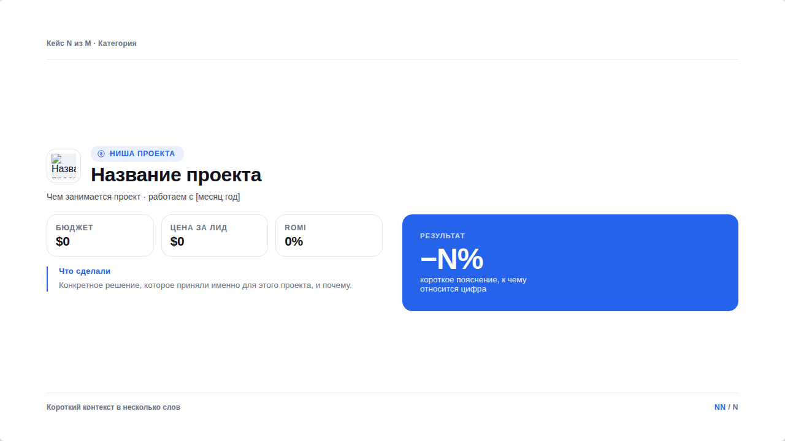 | Один кейс/проект на слайд: логотип, 3 показателя, «Что сделали» и крупная акцентная карточка с результатом — для портфолио кейсов |

## Как собрать презентацию из блоков

0. Если нужно нетиповое, более эффектное настроение — сначала посмотреть
   [`shared/references/design-inspiration.md`](../references/design-inspiration.md):
   там 2 репозитория-референса (open-design, better-design) и разбор
   бренд-кита Diskurs с конкретными приёмами (не копировать код целиком —
   брать числа/приём и переносить в `deck.css` своим классом).
1. Скопировать `shared/templates/slide-deck.html` в `html/<slug>/index.html`
2. Для каждого нужного слайда — открыть подходящий блок отсюда, скопировать
   его `<section>…</section>` в `
`, поправить текст/картинки/
   числа по комментарию в начале файла
3. Проверить нумерацию `<b class="num">NN</b> / N` на каждом слайде и в `#total`
4. `node scripts/inline-deck.mjs <slug>` — встроить CSS/JS/шрифты/картинки,
   чтобы файл можно было переслать одним куском
5. `npm run export -- <slug>` — получить PDF (см. «Экспорт в PDF» в корневом README)

## Правила, которые уже прошиты в блоки (не нарушать при адаптации)

- **Одна сетка на слайд.** Если карточек несколько рядов — они должны быть
  в одном `.cols`, а не в двух разных с разным числом колонок (иначе ряды
  не выравниваются — так появился «хаос» на одном из первых вариантов).
- **Статус — не только цветом.** В `flow-diagram` «есть» и «нет» различаются
  и цветом, и формой иконки (галочка vs пунктирный круг).
- **Никаких `box-shadow`/`blur` на содержимом слайда.** `.card`, `.pill`,
  `.flow-node` держатся только на `border` — размытые тени при экспорте
  HTML в PDF (и headless Chromium, и обычная печать браузера) могут
  превращаться в жёсткие серые/синие прямоугольники-артефакты вместо
  мягкой тени. Глубина — не через тень, а через рамку/заливку/акцентный
  цвет. (Тень и блюр у `#deck`, стрелок и точек навигации — это элементы
  экранного слайд-шоу, в печать они не попадают и не затрагиваются.)
- **Главный результат — крупно, не сноской.** Если у слайда есть один
  ключевой вывод/цифра, ей положена самая большая и заметная подача на
  слайде (акцентная карточка, `.stat-big` 40px+), а не мелкий текст в
  `.bottom-row` — там она теряется. См. `case-metrics.html`.
- **Никаких сносок со звёздочкой.** Если у цифры есть оговорка (ROMI
  ниже из-за LTV и т.п.) — пиши её сразу под значением, в той же
  карточке, мелким текстом. Звёздочка с объяснением в другом месте
  слайда (или тем более на другом слайде) заставляет читателя искать.
